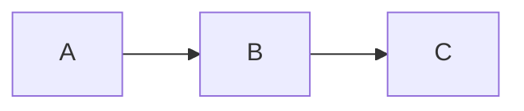

# 博客写作规则

## 项目概述

这是陈大剩（cxbdasheng）的个人技术博客，域名 [aio.it927.com](https://aio.it927.com)，基于 **MkDocs + Material 主题**搭建。内容以技术实战为主，覆盖家庭 AIO 服务器搭建（ESXi 虚拟化、软路由、黑群晖、远程穿透等），面向有一定技术基础的读者。

---

## 语言与风格

- 全部使用**简体中文**写作
- 语气亲切、接地气，可适当口语化，保持「陈大剩」的个人风格
- 技术术语保留英文原文，例如 `ESXi`、`CDN`、`WebP`，不强行翻译
- 行文直接，避免官方腔调和过多废话
- 可以适当加入个人感受、踩坑经历，增加可读性

---

## 项目结构

```
docs/                  # 所有源文章
├── prefaces/          # 前言介绍
├── preparation/       # 准备工作
├── network/           # 网络架构
├── esxi/              # ESXi 进阶操作
├── route/             # 软路由
├── synology/          # 黑群晖
├── home/              # 家庭工作区
├── remote/            # 远程穿透
├── qa/                # 常见 Q&A
└── index.md           # 首页
mkdocs.yml             # 站点配置（含导航 nav）
```

---

## 文件命名

- 文件名使用**英文小写**，单词间用连字符 `-` 分隔，例如：`install-esxi.md`、`ssl-acme.md`
- 文件放在对应模块目录下（`docs/<模块>/`）
- 本项目所有图片使用 CDN，**不在本地创建图片目录**

---

## Front Matter（文章元信息）

正式发布的文章需要添加 YAML Front Matter，格式如下：

```yaml
---
slug: url-friendly-slug
keywords:
  - 关键词1
  - 关键词2
  - 关键词3
description: 一句话介绍文章内容（100字以内，用于 SEO 摘要）
---
```

- **没有 `title` 字段**，标题由正文第一行的 `# 一级标题` 决定
- `slug` 使用英文，全小写，单词间用连字符 `-` 连接
- `keywords` 覆盖核心搜索词，一般 3-7 个
- 草稿文章可不加 Front Matter

---

## 文章结构

推荐结构（根据内容类型灵活调整）：

```markdown
# 文章标题

（可选：一句话背景介绍）

## 背景 / 问题现象
## 准备工作（工具、前置条件）
## 操作步骤（可细分 ### 子标题）
## 遇到的问题 / 踩坑记录
## 总结
```

- 用 `# 一级标题` 写文章标题（MkDocs 会渲染为页面标题）
- 正文各节用 `##` 二级标题，子节用 `###`
- 步骤类内容优先使用有序列表，特性/配置列表使用无序列表
- 代码块必须标注语言类型，例如：` ```bash `、` ```go `、` ```yaml `

---

## MkDocs 特有语法

项目启用了以下 Material 扩展，写作时可充分利用：

**提示块（Admonition）：**

```markdown
!!! note "标题"
    内容（缩进 4 格）

??? warning "可折叠提示"
    默认折叠的内容

???+ tip "默认展开的折叠块"
    默认展开的内容
```

常用类型：`note`、`tip`、`warning`、`danger`、`info`、`success`

**选项卡（Tabs）：**

```markdown
=== "Windows"
    Windows 下的操作

=== "Linux"
    Linux 下的操作
```

**Mermaid 图表：**

````markdown

````

---

## 图片规范

- 所有图片上传 CDN，路径格式：`https://img.it927.com/aio/<文件名>`
- 图片必须填写 alt 文字，推荐加 title，格式：
  ```markdown
  
  ```
- 每张图片前后保留一个空行

---

## 代码规范

- 行内代码使用反引号，例如 `favicon.ico`、`301`
- 命令行操作使用 `bash` 代码块
- 配置文件根据实际格式标注（`yaml`、`json`、`nginx` 等）
- 代码块内容应完整可运行，不要省略关键部分

---

## 新增文章流程

1. 在 `docs/<模块>/` 下新建英文命名的 `.md` 文件
2. 在 `mkdocs.yml` 的 `nav` 中注册（否则文章不会出现在导航）
3. 写完后补充 Front Matter（`slug`、`keywords`、`description`）

---

## Git 提交规范

格式：`type(scope): 中文描述`

- `type`：`docs`（新增/修改文章）、`chore`（配置、脚本等杂项）、`fix`（修正错误）
- `scope`：模块名，如 `remote`、`esxi`、`synology`
- 示例：`docs(remote): 添加 IPv6 DDNS 详细配置指南`

---

## 内容质量

- 文章要有**明确的结论或解决方案**，不写无结尾的流水账
- 遇到坑时，要说明**根本原因**，不只是给出解决步骤
- 引用外部工具或服务时，附上官方链接
- 全网首发或无解决方案的内容，可在文中强调（如「目前全网未见相关解决方案」）