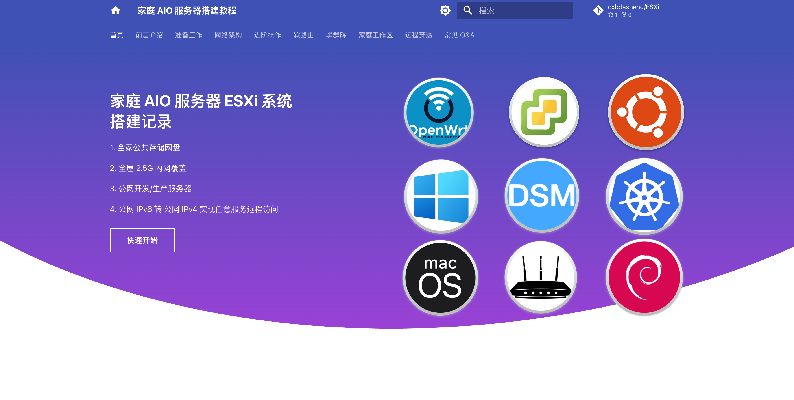

# 🚀 家庭 All-in-One 服务器搭建指南

> 💪 一台电脑顶十台！让每一颗 CPU、每一 GB 内存都发挥极致性能

## 📖 项目简介

这是一个完整的家庭 All-in-One 服务器搭建指南，帮助大家在家中搭建企业级的虚拟化环境。通过本项目，可以：

- 🏠 告别昂贵云服务，在家享受企业级数据中心的强大功能
- 🖥️ Windows、Linux、OpenWrt、macOS 多系统同时运行
- 🌐 全家设备随时随地公网访问，突破网络限制
- 💰 大幅降低 IT 成本，一台设备替代多台专用设备

## ✨ 主要特性

- **多系统虚拟化**: 同时运行多个操作系统，资源高效利用
- **网络穿透**: 实现公网访问，让家变成专属云端
- **企业级性能**: 充分发挥硬件性能，达到企业级标准
- **详细文档**: 从零开始的完整搭建指南
- **成本优化**: 一次投入，长期受益

## 前置要求

- 一台支持虚拟化的电脑（推荐配置：16GB+ 内存，500GB+ 存储）
- VMware ESXi 安装介质
- 基本的网络配置知识

### 参与贡献
- Docker & Docker Compose（推荐）
- Python 3.11+
- Git

##  贡献指南
由于个人水平有限，加上编写时间仓促，教程中难免存在不准确之处，欢迎大家指正并提交 [PR](https://github.com/cxbdasheng/AIO/pulls) 完善内容，贡献请阅读的 [贡献指南](CONTRIBUTING.md) 了解：

- 如何报告问题和提出建议
- 文档编写规范和要求
- 代码提交流程和规范
- Pull Request 最佳实践

## 教程地址
[🚀 陈大剩的家庭 All-in-One 服务器搭建指南](https://aio.it927.com/)

