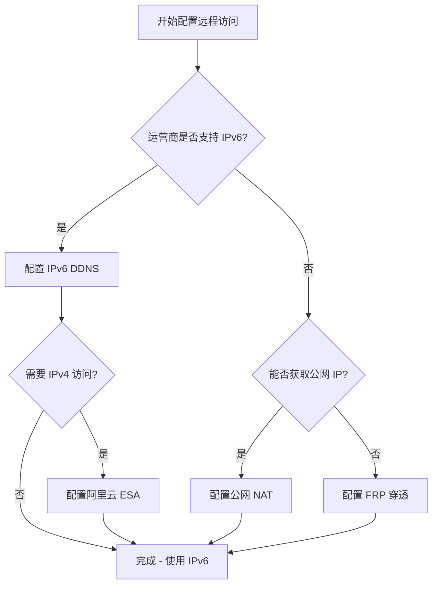

作为一名程序员，家中肯定是需要一台生产服务器，装上第三方运维面板，后续配合免费 [CDN 中转](../remote/esa.md)，可以轻松实现云服务器 HTTP 管理的效果。 

通过 ESXi 虚拟化环境搭建的生产服务器，可以用于代码开发、项目测试、容器编排、CI/CD 流程等多种场景，既能满足日常技术学习需求，又能作为个人项目的稳定生产环境。

## 系统选型

### 推荐的 Linux 发行版

根据不同使用场景，陈大剩推荐以下 Linux 发行版：

| 发行版 | 适用场景 | 优势 | 推荐指数 |
|--------|---------|------|---------:|
| **Ubuntu Server 22.04 LTS** | 通用开发、学习环境 | 生态完善、文档丰富、软件包新 | ⭐⭐⭐⭐⭐ |
| **Rocky Linux 9** | 生产环境、企业级应用 | CentOS 继承者、稳定性强 | ⭐⭐⭐⭐ |
| **Debian 12** | 轻量级服务器、容器宿主 | 占用资源少、纯净稳定 | ⭐⭐⭐⭐ |
| **Arch Linux** | 极客玩家、高度定制 | 软件包最新、高度可控 | ⭐⭐⭐ |

陈大剩个人推荐使用 **Ubuntu Server 22.04 LTS**，它兼具稳定性和新特性，社区支持好，适合大多数开发场景，且具有图形界面，代码崩溃了还可上 ESXi 中通过图形界面恢复。

## 硬件规划

根据生产服务器的使用需求，建议采用以下配置：

| 组件      | 推荐配置 | 最低配置 | 说明 |
|---------|---------|---------|------|
| **CPU** | 20 vCPU | 4 vCPU | 多核心提升容器并发性能 |
| **内存**  | 32 GB | 8 GB | Docker 容器建议预留充足内存 |
| **硬盘**  | 300GB SSD | 50GB SSD | 用于存储代码、数据库、日志 |

## 安装 Ubuntu 22.04 LTS

安装 Ubuntu 22.04 LTS 的详细流程在 [网络架构 - 跳板机使用](../network/jumper.md) 章节已有介绍，本文针对生产服务器的特点进行补充说明。

### 准备工作

#### 1. 下载 Ubuntu ISO 镜像

根据使用场景选择合适的 Ubuntu 版本：

=== "Ubuntu Server LTS(服务器推荐)"

    **适用场景:** 纯服务器环境，无图形界面，资源占用少。

    - 下载地址：[Ubuntu Server 22.04 LTS](https://ubuntu.com/download/server)
    - 文件大小：约 1.4 GB
    - 推荐版本：22.04 LTS(支持到2027年)
    - **优势**：内存占用低、系统纯净、适合容器部署


=== "Ubuntu Desktop LTS(开发环境推荐)"

    **适用场景:** 需要图形界面的开发环境，便于调试和故障处理。

    - 下载地址：[Ubuntu Desktop 22.04 LTS](https://ubuntu.com/download/desktop)
    - 文件大小：约 4.7 GB
    - 资源需求：更高的 CPU 和内存要求
    - **优势**：图形界面、易于操作、便于恢复

#### 2. 上传 ISO 到 ESXi 数据存储

将下载的 ISO 文件上传到 ESXi 数据存储：

1. 登录 ESXi 管理后台
2. 导航:**存储** → **数据存储浏览器**
3. 选择目标数据存储
4. 创建 ISO 文件夹(可选)
5. 点击【上传文件】


### 创建虚拟机

#### 1. 新建虚拟机向导

**导航路径**：【虚拟机】→【创建/注册虚拟机】，按照向导完成以下步骤：

=== "步骤 1：选择创建类型"

    选择【创建新虚拟机】
    

=== "步骤 2：选择名称和操作系统"

    - **名称**：建议使用有意义的名称
    - **客户机操作系统系列**：【Linux】
    - **客户机操作系统版本**：【Ubuntu Linux (64位)】
    

=== "步骤 3：选择存储"

    选择合适的数据存储，建议选择 SSD 存储以提升性能
    

#### 2. 自定义虚拟机硬件

根据前面的硬件规划配置虚拟机，以下是详细的配置步骤：

=== "自定义 1：CPU 配置"

    - 根据需求分配 vCPU 数量
    - 建议至少分配 4 vCPU，推荐 8-20 vCPU
    

=== "自定义 2：内存配置"

    - 根据需求分配内存大小
    - 建议至少 8GB，推荐 16-32GB
    - **重要**：如果需要使用 PCI 直通功能，必须勾选【预留所有客户机内存】
    

=== "自定义 3：硬盘设置"

    - 设置硬盘大小，建议至少 100GB
    - 选择【精简置备】可节省存储空间
    

=== "自定义 4：网络适配器"

    根据网络架构需求添加网络适配器：

    - **VM Network**：ESXi 管理网段(如需代理 ESXi)
    - **其他网络**：根据网络拓扑添加相应网段
    - 建议使用 VMXNET 3 适配器类型以获得最佳性能
    

=== "自定义 5：挂载 ISO 镜像"

    - 选择 【CD/DVD 驱动器】
    - 选择【数据存储 ISO 文件】
    - 浏览并选择上传的 【Ubuntu ISO】镜像
    - 勾选【连接】选项
    

配置完成后，仔细检查所有设置，确认无误后点击【完成】。

### 开始安装

#### 安装流程

配置完成后，启动虚拟机开始安装系统。以下是针对 Ubuntu Desktop 的安装流程：

=== "步骤 1：引导页面"

    等待系统加载，选择 **Try or Install Ubuntu**(尝试或安装 Ubuntu)
    

=== "步骤 2：选择语言"

    在安装程序首页选择【中文(简体)】，然后点击【安装 Ubuntu】
    

=== "步骤 3：选择键盘布局"

    保持默认的键盘布局设置，点击【继续】
    

=== "步骤 4：安装选项"

    - **安装类型**：选择【最小安装】
    - **其他选项**：
        - 勾选【安装 Ubuntu 时下载更新】(如网络良好)
        - 可选择【安装第三方软件】以支持更多硬件
    

=== "步骤 5：安装类型"

    选择【清除整个磁盘并安装 Ubuntu】

    - 系统会弹出确认对话框，检查磁盘信息后点击【继续】
    - 此操作会清除所选磁盘的所有数据
    

=== "步骤 6：选择时区"

    - 在地图上点击中国区域，或手动输入【上海】
    - 系统会自动设置为 Asia/Shanghai 时区
    

=== "步骤 7：创建用户账户"

    设置系统管理员账户：

    - **您的姓名**：显示名称
    - **计算机名称**：主机名(建议使用有意义的名称)
    - **用户名**：登录用户名
    - **密码**：设置强密码(生产环境建议使用复杂密码)
    - **确认密码**：再次输入密码
    

#### 完成安装

系统安装需要 10-20 分钟，期间会显示安装进度和 Ubuntu 功能介绍。

安装完成后，系统还会提示安装完成，需要重启一次

至此，已经安装完成了 Ubuntu，稍后关机后，可以将 [存储和硬件配置-自定设置 5：添加镜像](#__tabbed_3_5) 添加的镜像给删除。


## 基础环境配置

### 1. 配置固定 IP 地址

为防止 DHCP 导致的 IP 地址变化，需要为所有网卡配置静态 IP。

=== "步骤 1：查看当前网络配置"

    打开终端，查看当前分配的 IP 地址和网卡信息：

    ```bash
    ip addr show
    ```

    记录下各网卡的名称(如 ens160、ens192 等)和当前 IP 地址
    

=== "步骤 2：配置静态 IP(GUI 方式)"

    如果使用 Ubuntu Desktop：

    1. 点击右上角网络图标
    2. 选择"网络设置"或"设置"
    3. 在网络设置中选择对应的网络连接
    4. 点击设置图标(⚙️)进入详细配置
    5. 在 IPv4 标签页中：
        - **方法**：选择"手动"
        - **地址**：输入 IP 地址、子网掩码、网关
        - **DNS**：输入 DNS 服务器地址
    6. 点击"应用"保存配置
    

=== "步骤 2：配置静态 IP(命令行方式)"

    如果使用 Ubuntu Server，需要编辑 Netplan 配置文件：

    ```bash
    # 编辑网络配置文件
    sudo vim /etc/netplan/00-installer-config.yaml
    ```

    配置示例：

    ```yaml
    network:
      version: 2
      ethernets:
        ens160:
          dhcp4: false
          addresses:
            - 192.168.1.100/24
          routes:
            - to: default
              via: 192.168.1.1
          nameservers:
            addresses: [223.5.5.5， 114.114.114.114]
        ens192:
          dhcp4: false
          addresses:
            - 10.0.0.10/24
    ```

    应用配置：

    ```bash
    sudo netplan apply
    ```

### 2. 更换软件源

为了提升软件包下载速度，建议更换为国内镜像源：

```bash
# 备份原始源配置
sudo cp /etc/apt/sources.list /etc/apt/sources.list.bak

# 更换为阿里云镜像源
sudo sed -i 's@//.*archive.ubuntu.com@//mirrors.aliyun.com@g' /etc/apt/sources.list
sudo sed -i 's@//.*security.ubuntu.com@//mirrors.aliyun.com@g' /etc/apt/sources.list

# 更新软件包列表
sudo apt update && sudo apt upgrade -y
```

### 3. 安装常用工具

安装开发和运维必备的基础工具：

```bash
# 系统基础工具
sudo apt install -y \
    git curl wget vim nano \
    htop iotop iftop \
    tmux screen \
    net-tools dnsutils iputils-ping traceroute \
    openssh-server

# 编译工具链
sudo apt install -y build-essential

# 压缩解压工具
sudo apt install -y zip unzip tar gzip

# 系统监控工具
sudo apt install -y sysstat lsof strace
```

### 4. 配置 SSH 服务

优化 SSH 配置以提升安全性和便利性：

```bash
# 编辑 SSH 配置
sudo vim /etc/ssh/sshd_config
```

推荐的安全配置：

```bash
# 禁用 root 直接登录(可选)
PermitRootLogin no

# 启用公钥认证
PubkeyAuthentication yes

# 禁用密码认证(配置好密钥后)
# PasswordAuthentication no

# 修改默认端口(可选，增强安全性)
# Port 22222
```

重启 SSH 服务：

```bash
sudo systemctl restart sshd
```

## 安装第三方运维面板
生产服务器不可能每次都使用 SSH 访问，这加大了我们是使用的难度，我们可以使用第三方运维面板来管理服务器。

运维面板可以简化日常的部署和运维工作，陈大剩推荐使用 [宝塔面板](https://www.bt.cn/new/index.html)，宝塔面板是国内厂商开发的运维面板，使用起来非常简单，支持 Web 访问，后续配合远程穿透，就可以实现远程访问。


### 获取宝塔安装命令

=== "步骤 1：访问宝塔官网"

    访问 [宝塔官网](https://www.bt.cn/new/index.html)，点击【Linux面板】
    

=== "步骤 2：复制安装命令"

    选择对应的操作系统(Ubuntu)，复制提供的安装命令
    

### 安装面板

=== "步骤 1：SSH 登录服务器"

    使用 SSH 工具连接到生产服务器：

    ```bash
    ssh username@server-ip
    ```
    

=== "步骤 2：执行安装命令"

    粘贴从官网复制的安装命令并执行：

    ```bash
    wget -O install.sh https://download.bt.cn/install/install-ubuntu_6.0.sh && sudo bash install.sh ed8484bec
    ```

    安装过程中会提示确认，输入 `y` 继续
    

=== "步骤 3：记录登录信息"

    安装完成后，屏幕会显示面板的登录信息：

    - **面板地址**：http://服务器IP:端口/安全入口
    - **用户名**：管理员用户名
    - **密码**：管理员密码

    请妥善保存这些信息
    

    ???+ info "关于外网地址的说明"
        登录信息中显示的"外网 IPv4"实际上是从上级路由获取的地址(运营商分配的地址)，并非真正的公网 IP。如果需要外网访问，需要配置端口映射或使用内网穿透服务。

### 使用面板

=== "步骤 1：浏览器访问"

    使用浏览器访问面板地址，输入用户名和密码登录
    

=== "步骤 2：同意用户协议"

    首次登录需要阅读并同意用户协议
    

=== "步骤 3：绑定官网账号"

    宝塔国内版需要绑定官网账号才能使用：

    - 如已有账号，直接登录绑定
    - 如无账号，点击注册新账号
    

=== "步骤 4：关闭推荐弹窗"

    首次进入会弹出推荐安装套件，可以：

    - 选择需要的套件进行一键安装
    - 或点击【不再显示推荐】跳过
    

### 面板基础使用

成功登录后，即可使用宝塔面板的各项功能：


**常用功能**：

- **软件商店**：安装 Nginx、MySQL、PHP、Redis 等软件
- **文件管理**：Web 界面管理服务器文件
- **网站管理**：创建和管理网站
- **数据库管理**：创建和管理数据库
- **计划任务**：设置定时任务
- **安全管理**：防火墙、SSH 端口修改等


???+ tip "宝塔面板安全建议"
    1. 安装后立即修改默认端口
    2. 启用面板 SSL 证书
    3. 绑定域名访问
    4. 定期更新面板版本
    5. 启用两步验证(如支持)

## 远程穿透

完成宝塔面板的安装后，你可能会面临一个新的问题：**如何在外网访问家中的服务器？**

默认情况下，宝塔面板只能在局域网内访问。如果需要随时随地管理服务器、访问部署的应用，就需要配置远程穿透方案。

### 为什么需要远程穿透

家庭生产服务器的核心价值之一就是**远程可访问性**。通过远程穿透，你可以：

- **随时管理**：外出时通过手机/电脑访问宝塔面板
- **服务部署**：让部署的 Web 应用能被外网访问
- **团队协作**：与他人分享开发环境或演示项目
- **远程开发**：在任何地方都能连接家中的开发环境

### 方案选择

根据你的网络环境和需求，可以选择不同的远程访问方案：

| 方案 | 适用场景 | 优势 | 成本 |
|------|---------|------|------|
| **[IPv6 DDNS](../remote/ipv6.md)** | 运营商支持 IPv6 | 免费、直连、速度快 | 免费 |
| **[阿里云 ESA](../remote/esa.md)** | 需要 IPv4/IPv6 双栈访问 | 免费、稳定、全球加速 | 免费 |
| **[IPv6 转 IPv4](../remote/ipv6-ipv4.md)** | 仅 IPv6 环境 | 解决兼容性问题 | 部分收费 |
| **[FRP 内网穿透](../remote/frp.md)** | 纯内网环境 | 通用性强、配置灵活 | 需购买服务器 |
| **[公网 NAT](../remote/nat.md)** | 运营商支持公网 IP | 性能最佳、配置简单 | 取决于运营商 |

### 推荐配置路径

根据陈大剩的实践经验，推荐按以下优先级尝试：


### 更多信息

如需了解远程穿透的技术原理和方案对比，请参考 [远程穿透概述](../remote/overview.md)。
