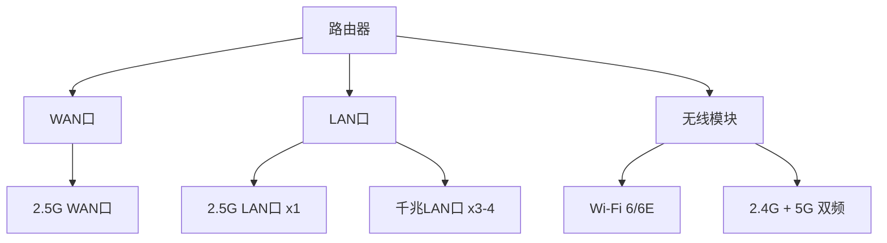
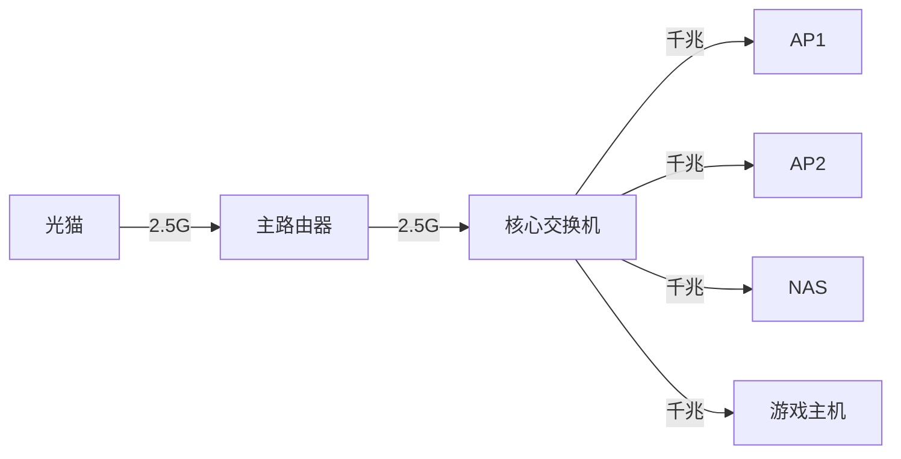

---
keywords:
  - 千兆宽带优化
  - 2.5G网络升级
  - 万兆网络部署
  - 光猫升级
  - 路由器选购
  - 网络瓶颈分析
  - 家庭网络优化
  - 高速宽带配置
  - 网络设备升级
  - 带宽测试优化
description: 详细分析千兆宽带无法跑满的原因，提供光猫和路由器升级方案，实现突破1000M带宽限制的完整解决方案。
---
在使用千兆宽带时会发现一个现象：明明办理的是 1000M 宽带，但实际测速往往只能达到 800-950M，很难跑满理论带宽。其实这背后的原因并非运营商"缩水"，而是涉及到网络设备的物理限制和协议开销，本文来教大家 1000M 宽带突破到 1200M，甚至更高。
## 带宽限制的根本原因
### 1. 运营商预留机制

运营商在提供宽带服务时，通常会预留 10%-20% 的带宽余量：

- **1000M 宽带** → 实际可能提供 **1100-1200M**
- **500M 宽带** → 实际可能提供 **550-600M**
- **200M 宽带** → 实际可能提供 **220-240M**

!!! info "余量作用"
    余量具体要看地区和某个运营商，余量主要用于：

    - 补偿网络传输中的协议开销；
    - 应对网络拥塞时的性能下降；
    - 确保用户能够达到承诺的最低速率；

### 2. 千兆网口的物理限制

标准千兆以太网口的理论最大传输速率为 1000Mbps，但实际可用带宽会因以下因素降低：

=== "协议开销"
    - **以太网帧头**：18 字节（目标MAC + 源MAC + 类型 + FCS）；
    - **IP 头部**：20 字节（IPv4）或 40 字节（IPv6）；
    - **TCP 头部**：20-60 字节；
    - **应用层协议**：HTTP、FTP 等额外开销；

=== "物理损耗"
    - **信号衰减**：网线长度和质量影响；
    - **接口老化**：长期使用导致的性能下降；
    - **电磁干扰**：周围设备的信号干扰；
    - **温度影响**：高温环境下的性能降低；

=== "设备处理能力"
    - **CPU 性能**：路由器和光猫的处理能力限制；
    - **内存带宽**：数据缓存和转发的瓶颈；
    - **固件优化**：软件层面的性能限制；

### 3. 网络拓扑瓶颈

典型家庭网络拓扑中的瓶颈点：


红色标注的设备通常是性能瓶颈所在。

## 突破方案：升级到 2.5G/万兆网络
综和前面的几个原因，能看到 **只需要支持 1000Mbps 以上的硬件设备**，即可以突破方案 1000M 宽带，目前支持 1000Mbps 以上的硬件设备有 2.5G、5G 、万兆。
### 方案对比
| 升级方案 | 理论带宽 | 成本 | 兼容性 | 推荐指数 |
|---------|---------|------|--------|----------|
| 2.5G 升级 | 2500Mbps | 中等 | 良好 | ⭐⭐⭐⭐⭐ |
| 5G 升级 | 5000Mbps | 较高 | 一般 | ⭐⭐⭐⭐ |
| 万兆升级 | 10000Mbps | 很高 | 较差 | ⭐⭐⭐ |

!!! tip "推荐方案"
    对于家庭用户，陈大剩推荐选择 **2.5G 升级** ，性价比高且兼容性好，目前陈大剩也是用的这个方案。

## 升级到 2.5G 方案
### 2.5G 光猫选购指南
光猫选购这块，大部光猫都是运营商定制版，比如中兴的某款电信版光猫，可以再找找它有没有联通版或移动版定制版。

其实光猫不存在单运营商使用，因为芯片处理都是不能可能定制的，仅能定制软件系统，所以要看 **光猫能不能刷机，能不能改参数**，比如陈大剩现在就是用的电信定制版光猫，但我的宽带是移动 1000M。
### 核心需求分析
说到核心参数，陈大剩认为核心参数要求如下：
=== "网口配置"
    - **上行接口**：GPON/EPON 光纤接口
    - **下行接口**：至少 1 个 2.5G 网口
    - **备用接口**：2-4 个千兆网口
    - **管理接口**：1 个百兆管理口（可选）

=== "性能指标"
    - **处理器**：双核 ARM Cortex-A53 或更高
    - **内存**：512MB DDR3 或更高
    - **闪存**：128MB NAND Flash 或更高
    - **转发性能**：≥ 2.5Gbps 线速转发

=== "协议支持"
    - **光纤标准**：GPON/EPON/XG-PON
    - **网络协议**：IPv4/IPv6 双栈
    - **管理协议**：TR-069、OMCI
    - **安全协议**：WPA3、防火墙

### 型号选择
经过了几天的筛选，陈大剩最终选中了 **中兴 F7005TV3** 这款电信定制光猫，这款光猫简直是我的梦中情猫，体积小，可刷机，无 WIFI，最 **重要的是仅 ￥90 元**，我太爱这个光猫了。
=== "光猫图一"
    

=== "光猫图二"
    

=== "光猫图三"
    

!!! warning "兼容性检查"
    购买前务必确认：

    - 是否可刷机；
    - 是否需要运营商激活；
    - 固件版本是否支持所需功能；

### 刷机支持其他运营商
因陈大剩用的是移动宽带，用这款电信定制版光猫还需要刷机，需先记住老光猫的参数，首先登入老光猫，陈大剩这里为移动光猫为例，用超级管理登入：

需要记住的参数有：设备标识号、MAC信息、宽带识别码（没有可不选）
```shell
宽带识别码：
MAC：18:4F:43:56:C3:BA
设备识别码（SN）：F09CD7-UMTC38178AD3 
```
#### 刷入新光猫
##### 开启 telnet
首先第一个是开启 `telnet`，一般购买的时候商家会给你开启，记得让商家给你账号密码。如果没有开启的话，我们自己也可以开启，需要准备一台 Windows 控制电脑。

用一根网线连接光猫和控制电脑，获取到 IP 以后，在浏览器中输入 `192.168.1.1` 访问光猫并登入，账号：`telecomadmin`；密码：`nE7jA%5m`；

修改连接电脑网卡的 MAC 地址，导航【网络和共享中心】-【以太网】-【网络地址】-【值】，输入：`000729553557`

使用开源项目 [zteOnu](https://github.com/Septrum101/zteOnu) 解锁 `telnet`。
=== "进入 zteOnu Releases"
    进入后点击【Releases】按钮
    

=== "选择合适的 zteOnu 版本"
    根据自己的操作系统，选择下载并解压
    

=== "运行 zteOnu"
    导航到 zteOnu 解压目录，用 CMD 输入 `zteOnu --telnet`
    

=== "等待执行成功"
    如看到如下标识，则证明开启 telnet 成功，否则请多次尝试
    

##### 修改新光猫参数
通过命令终端 `telnet 192.168.1.1` 登入到路由器，账号：`root` ;密码：`Zte521`，先查看系统参数;
```shell
# 查看系统参数
setmac show2 
```
输出后可以看到

可以按照如下命名修改：
```shell
setmac 1 修改 2查看 3删除
setmac 1 [ID] [内容]
setmac 1 32769   修改光猫的MAC地址（可选），列如格式是：setmac 1 32769 B4:BA:12:B8:EE:50
setmac 1 2176    gponSN前4位
setmac 1 2177    gponSN后8位
setmac 1 768     设备标识码前6位数字（可选）
setmac 1 512     设备标识码后17位数字（可选）
setmac 1 2180 LOID （与2179不同时改）
setmac 1 2179 password （与2180不同时改）
```
由于我是移动用户，只需要修改 MAC 地址和设备号
```shell
setmac 1 2176 F09CD7
setmac 1 2177 UMTC38178AD3
setmac 1 32769 18:4F:43:56:C3:BA
```
改完后 `reboot` 命名重启即可。
#### PPPoE配置
最后我们仅需配置 PPPoE 即可上网，有 VLAN ID 的也记得配置好。


### 测速
配置完即可测试，测速直接从光猫的 2.5G 网口中接线到 Windows电脑，测试的网络拓扑如下：

结果：


## 全屋 2.5G 网络覆盖
### 2.5G 路由器选购指南

#### 核心需求分析
接口需求

性能需求

| 功能模块 | 最低要求 | 推荐配置 |
|---------|---------|----------|
| CPU | 双核 1.2GHz | 四核 1.8GHz |
| 内存 | 256MB | 512MB+ |
| 闪存 | 128MB | 256MB+ |
| 无线 | Wi-Fi 6 AX1800 | Wi-Fi 6E AX3000+ |


### 网线和配件选择

#### 网线标准

| 类别 | 最大带宽 | 传输距离 | 适用场景 |
|------|---------|---------|----------|
| Cat5e | 1Gbps | 100m | 千兆网络 |
| Cat6 | 10Gbps | 55m | 万兆短距离 |
| Cat6A | 10Gbps | 100m | 万兆标准距离 |
| Cat7 | 10Gbps | 100m | 专业级应用 |

!!! tip "推荐选择"
    家庭环境建议使用 **Cat6** 或 **Cat6A** 网线，性价比最优。


### 网络拓扑优化




## 总结

通过升级到 2.5G 网络设备，