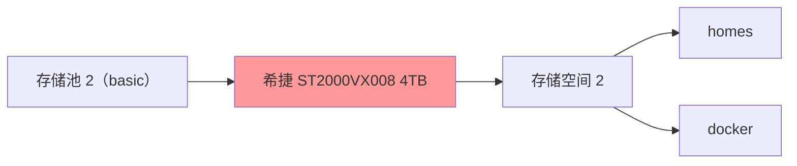
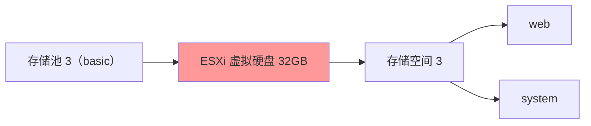

黑群晖存储设计是构建家庭 NAS 系统的核心环节，合理的存储架构直接影响数据安全性、系统性能和扩展能力。

## 存储架构设计
根据 [准备工作 - 硬盘划分](../preparation/disk-partitioning.md) 陈大剩将磁盘设置为三个存储池，架构如下：

## 架构解释

1. **存储池 1**：用于存储一些公共服务相关数据，可以对外提供展示，如 WEB 服务资源等；
2. **存储池 2**：用来存储私有化的关键数据，如影音、文件、重要资源，家庭数据等；
3. **存储池 3**：用于安装黑群晖和群晖系统套件，和 **存储池 1**、**存储池 2** 隔离开来；

**存储池 1** 和 **存储池 2** 使用第三方 **备份插件**，实时上传云盘，做多手冗余准备，及时某个物理磁盘坏了还能进行数据恢复。

**存储池 3** 是 ESXi 的虚拟硬盘，这样设计的好处是：下次换其他群晖版本或虚拟机，**存储池 1** 和 **存储池 2** 无需进行任何操作，仅需要进行磁盘重组，实现了操作系统无关性。

???+ warning "警告"
    按照陈大剩这样设计，并未进行灾备，如果硬盘坏了，则无法恢复数据，请勿参考。

## 最终效果
个人认为：如果不存小姐姐，4T 硬盘基本够用了，话说陈大剩个人空间从未用完过 2T，最终效果如下：

## 后续规划
在叨叨几句，细心的网友肯定发现了，陈大剩并未做任何 **灾备支持**，后续陈大剩将会采购 1T 和 4T 的硬盘给 **存储池 1**、**存储池 2** 组 raid1，这样坏了一个盘也能继续恢复。

