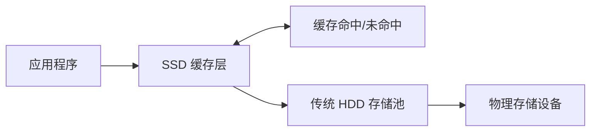

在 ESXi 虚拟化环境中为黑群晖配置 SSD 缓存可以显著提升存储性能。本教程将详细介绍如何通过 ESXi 虚拟磁盘为黑群晖创建 SSD 缓存，大幅改善系统读取性能。

## SSD 缓存工作原理

### 缓存机制概述

SSD 缓存在高速 SSD 和传统 HDD 之间建立了一个缓存层，将频繁访问的热点数据存储在 SSD 上，从而实现性能加速：



!!! info "缓存类型对比"
    - **只读缓存（Read-only）**：仅缓存读取数据，安全性高
    - **读写缓存（Read-write）**：同时缓存读写数据，性能提升更明显
    - **跳过顺序 I/O**：优化随机访问性能，避免缓存污染

### 性能提升效果
群晖系统的缓存效果因使用场景而异。建议优先使用只读缓存，因为成本较低（读写缓存需要 2 块 SSD 做 RAID），且安全性更高（只读缓存的 SSD 故障不会影响存储空间数据）。

**典型性能对比**：

| 操作类型 | 纯 HDD | HDD + SSD 缓存 | 提升倍数 |
|---------|--------|----------------|----------|
| **随机读取** | 120 IOPS | 3000+ IOPS | 25x |
| **随机写入** | 80 IOPS | 1500+ IOPS | 19x |
| **文件浏览** | 2-3 秒 | 0.5 秒 | 5x |
| **应用启动** | 10-15 秒 | 3-5 秒 | 3x |

!!! tip "适用场景"
    - **媒体服务器**：频繁访问的视频缩略图、封面和元数据
    - **文件服务器**：大量小文件的浏览和搜索操作
    - **数据库应用**：频繁的数据库查询和索引访问
    - **开发环境**：代码编译、构建和依赖库加载

## 环境准备

### 硬件要求

**SSD 选择建议**：

| 类型 | 推荐型号 | 容量建议 | 适用场景 |
|------|----------|----------|----------|
| **SATA SSD** | 三星 870 EVO、闪迪至尊高速 | 256-500GB | 家庭用户，预算有限 |
| **NVMe SSD** | 三星 980/980 PRO、WD SN570/SN850X | 500GB-1TB | 专业用户，性能优先 |
| **企业级 SSD** | 三星 PM9A3、Intel D7-P5510 | 1TB+ | 企业应用，高耐久性 |

**容量规划原则**：

```bash
# 缓存容量计算公式
热数据量 = 总数据量 × 20% (经验值)
SSD 缓存容量 = 热数据量 × 1.5 (预留空间)

# 示例 1：10TB 存储系统
热数据量 = 10TB × 20% = 2TB
建议缓存 = 2TB × 1.5 = 3TB
实际配置 = 500GB-1TB (根据预算调整)

# 示例 2：4TB 存储系统
热数据量 = 4TB × 20% = 800GB
建议缓存 = 800GB × 1.5 = 1.2TB
实际配置 = 200GB-500GB (根据需求调整)
```

## 创建 SSD 缓存虚拟磁盘

### 规划缓存磁盘
本示例中，我们将从 WD SN570 SSD 上划分两块虚拟硬盘，分别为两个 HDD 存储池提供只读缓存。

**缓存配置方案示例**：


### 创建虚拟磁盘

**使用 ESXi 控制台操作步骤**：

=== "步骤 1：选择虚拟机"
    在 ESXi 控制台中导航至【虚拟机和模板】，找到黑群晖虚拟机，右键点击并选择【编辑设置】。
    

=== "步骤 2：添加控制器"
    点击【添加其他设备】→【NVMe 控制器】，为虚拟机添加 NVMe 控制器。
    

=== "步骤 3：添加硬盘"
    点击【添加新设备】→【硬盘】，添加新的虚拟磁盘。
    

=== "步骤 4：配置磁盘参数"
    **关键配置项**：
    
    - **磁盘大小**：根据缓存需求设置（本示例为 120GB）
    - **磁盘置备**：选择【厚置备，置零】
    - **磁盘模式**：选择【独立 - 持久】
    - **虚拟设备节点**：选择 NVMe 控制器
    
    

**注意**：厚置备过程需要一定时间，期间请勿启动虚拟机。如果需要创建多个缓存磁盘，请重复上述步骤。


### 验证磁盘创建
启动虚拟机后，登录群晖管理界面，打开【存储管理器】即可看到新添加的 SSD 磁盘。

**检查虚拟机配置**：

```bash
# SSH 登录黑群晖后检查新磁盘
sudo fdisk -l | grep -E "(sd[a-z]|nvme)"

# 预期输出示例：
Disk /dev/nvme0n1: 80 GiB, 85899345920 bytes, 167772160 sectors
Disk /dev/nvme1n1: 120 GiB, 128849018880 bytes, 251658240 sectors

# 查看磁盘详细信息
lsblk -o NAME,SIZE,TYPE,MOUNTPOINT
```

**验证磁盘性能**：

```bash
# 测试顺序读取性能
sudo dd if=/dev/nvme0n1 of=/dev/null bs=1M count=1024 status=progress

# 测试随机读取性能（需先安装 fio 工具）
sudo fio --filename=/dev/nvme0n1 --direct=1 --rw=randread \
         --bs=4k --runtime=30 --numjobs=1 --name=test
```

## 配置 SSD 缓存

### 访问存储管理器
登录 DSM 系统后，在控制面板中找到并打开【存储管理器】。

### 创建只读缓存
=== "步骤一：创建 SSD 缓存"
    

=== "步骤二：选择存储空间"
    

=== "步骤三：选择缓存模式"
    

=== "步骤四：配置 RAID 类型"
    

=== "步骤五：选择硬盘"
    

=== "步骤六：分配 SSD 缓存容量"
    

=== "步骤七：检查设置"
    

完成上述步骤后，系统会弹出确认对话框，确认设置无误后点击【确定】。

配置完成后，在【存储管理器】中可以看到已挂载的 SSD 缓存及其状态。


## 总结
通过在 ESXi 环境中合理配置虚拟磁盘作为 SSD 缓存，可以显著提升黑群晖的存储性能。建议初次配置时选择只读缓存，待熟悉操作后再考虑读写缓存方案。

!!! warning "重要提醒"
    - **数据安全**：读写缓存存在数据丢失风险，重要数据必须做好备份
    - **电源保护**：建议使用 UPS 避免断电导致缓存数据损坏
    - **容量规划**：缓存容量过小效果有限，过大则浪费资源
    - **定期维护**：定期监控 SSD 健康状态，及时更换故障设备

!!! success "配置成功标志"
    - SSD 缓存创建成功并正常运行
    - 缓存命中率稳定在 70% 以上
    - 随机 I/O 性能显著提升
    - 系统整体响应速度明显改善
    - 无异常错误日志产生

